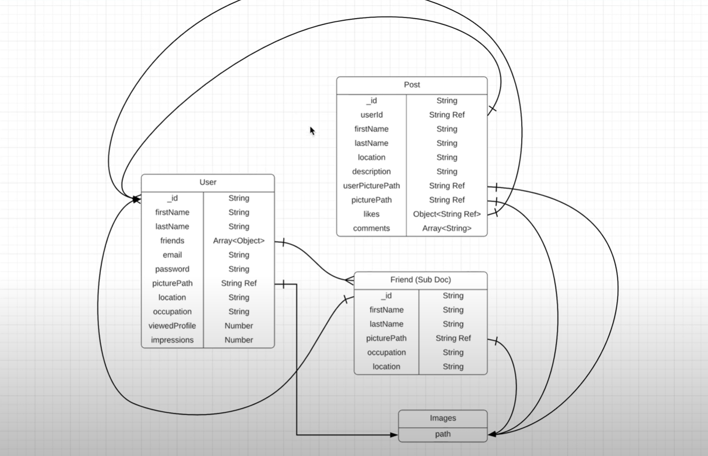

# Documentation - Connectopia

## Database schema

The database schema for the webite is as follows. The entities are User, Post, Friend and Images.



## Tech Stack and Functionality

### Express and NodeJS

Node.js isan open-source, cross-platform, single-threaded JavaScript runtime environment for building fast and scalable server-side and networking applications. It runs on the V8 JavaScript runtime engine and uses an event-driven, non-blocking I/O architecture, making it efficient and suitable for real-time applications.

NodeJS file extension is in JavaScript. (.js)

#### V8 Engine

V8 is the name of the JavaScript engine that powers Google Chrome. It's the thing that takes our JavaScript and executes it while browsing with Chrome. V8 provides the runtime environment in which JavaScript executes. The DOM and the other Web Platform APIs are provided by the browser.

V8 is written in C++, and it's continuously improved. It is portable and runs on Mac, Windows, Linux and several other systems.

#### Steps for starting a basic server

1. Load http module
2. Create HTTP server and listen on port 3000 for requests:
3. Listen for requests on port 3000, and as a cakkback function, have the port listened on logged.

#### Status Code for HTTP responses

Status code are returned for every request which is made to the server as a response.
Read more [here](https://developer.mozilla.org/en-US/docs/Web/HTTP/Status)

#### NodeMon

nodemon is a tool that helps develop Node.js based applications by automatically restarting the node application when file changes in the directory are detected.

nodemon does **not** require *any* additional changes to your code or method of development. nodemon is a replacement wrapper for `node`. To use `nodemon`, replace the word `node` on the command line when executing your script.

#### Installation

Either through cloning with git or by using [npm](http://npmjs.org/) (the recommended way):

```shell
npm install -g nodemon # or using yarn: yarn global add nodemon
```

And nodemon will be installed globally to your system path.

You can also install nodemon as a development dependency:

```shell
npm install --save-dev nodemon # or using yarn: yarn add nodemon -D
```

#### Usage

nodemon wraps your application, so you can pass all the arguments you would normally pass to your app:

```shell
nodemon [your node app]
```

### MongoDB and Mongoose

#### Installations and SetUp

To install and set-up MongoDB connection, install MongoDB at: [HERE](https://www.mongodb.com/)

If you install MongoDB with version higher than 6.0 then follow this steps to install[ Mongo and start server](https://www.youtube.com/watch?v=59Yhxwdgi7I&lc=Ugz0Ke0jiT9SMY-w6214AaABAg).

Mongoose Install

```
npm install mongoose
```

Note: If you encounter this error:


 Solution: Instead connecting database like:

```
mongoose.connect('mongodb://localhost/Contact_listDB');
```

Connect it in this manner:

```
mongoose.connect('mongodb://127.0.0.1:27017/Contact_listDB');
```

Know more about mongoose: [OFFCIAL DOCUMENTATION](https://mongoosejs.com/docs/index.html)

#### What is __v in mongoose?

The `versionKey` is a property set on each document when first created by Mongoose. This keys value contains the internal [revision](http://aaronheckmann.blogspot.com/2012/06/mongoose-v3-part-1-versioning.html) of the document. The `versionKey` option is a string that represents the path to use for versioning. The default is `__v`.


### Body Parser (body-parser)

[Express](https://www.simplilearn.com/tutorials/nodejs-tutorial/what-is-express-js "Express") body-parser is an npm module used to process data sent in an HTTP request body. It provides four [express middleware](https://www.simplilearn.com/tutorials/express-js-tutorial/about-express-js-middleware "express middleware") for parsing JSON, Text, URL-encoded, and raw data sets over an HTTP request body. Before the target controller receives an incoming request, these middleware routines handle it.

#### What exactly is body-parser?

* Body-parser parses is an HTTP request body that usually helps when you need to know more than just the URL being hit.
* Specifically in the context of a POST, PATCH, or PUT HTTP request where the information you want is contained in the body.
* Using body-parser allows you to access req.body from within routes and use that data.

#### Installations 

After installing express and creating a node env, install body-parser: 

```sh
$ npm install body-parser
```

### Cors [Middleware] 

CORS is a node.js package for providing a [Connect](http://www.senchalabs.org/connect/)/[Express](http://expressjs.com/) middleware that can be used to enable [CORS](http://en.wikipedia.org/wiki/Cross-origin_resource_sharing) with various options.

#### Installation

```sh
$ npm install cors
```

### Dotenv (dotenv)

`dotenv` allows you to separate secrets from your source code. This is useful in a collaborative environment (e.g., work, or open source) where you may not want to share your database login credentials with other people. Instead, you can share the source code while allowing other people to create their own `.env` file.

### Multer [Middleware]

Multer is a node.js middleware for handling `multipart/form-data`, which is primarily used for uploading files. It is written on top of [busboy](https://github.com/mscdex/busboy) for maximum efficiency.

#### Installation

```shell
$ npm install --save multer
```

### Helmet

Helmet helps secure Express apps by setting HTTP response headers.

#### Default Headers in Helmet

* [`Content-Security-Policy`](https://www.npmjs.com/package/helmet#content-security-policy): A powerful allow-list of what can happen on your page which mitigates many attacks
* [`Cross-Origin-Opener-Policy`](https://www.npmjs.com/package/helmet#cross-origin-opener-policy): Helps process-isolate your page
* [`Cross-Origin-Resource-Policy`](https://www.npmjs.com/package/helmet#cross-origin-resource-policy): Blocks others from loading your resources cross-origin
* [`Origin-Agent-Cluster`](https://www.npmjs.com/package/helmet#origin-agent-cluster): Changes process isolation to be origin-based
* [`Referrer-Policy`](https://www.npmjs.com/package/helmet#referrer-policy): Controls the [`Referer`](https://developer.mozilla.org/en-US/docs/Web/HTTP/Headers/Referer) header
* [`Strict-Transport-Security`](https://www.npmjs.com/package/helmet#strict-transport-security): Tells browsers to prefer HTTPS
* [`X-Content-Type-Options`](https://www.npmjs.com/package/helmet#x-content-type-options): Avoids [MIME sniffing](https://developer.mozilla.org/en-US/docs/Web/HTTP/Basics_of_HTTP/MIME_types#mime_sniffing)
* [`X-DNS-Prefetch-Control`](https://www.npmjs.com/package/helmet#x-dns-prefetch-control): Controls DNS prefetching
* [`X-Download-Options`](https://www.npmjs.com/package/helmet#x-download-options): Forces downloads to be saved (Internet Explorer only)
* [`X-Frame-Options`](https://www.npmjs.com/package/helmet#x-frame-options): Legacy header that mitigates [clickjacking](https://en.wikipedia.org/wiki/Clickjacking) attacks
* [`X-Permitted-Cross-Domain-Policies`](https://www.npmjs.com/package/helmet#x-permitted-cross-domain-policies): Controls cross-domain behavior for Adobe products, like Acrobat
* [`X-Powered-By`](https://www.npmjs.com/package/helmet#x-powered-by): Info about the web server. Removed because it could be used in simple attacks
* [`X-XSS-Protection`](https://www.npmjs.com/package/helmet#x-xss-protection): Legacy header that tries to mitigate [XSS attacks](https://developer.mozilla.org/en-US/docs/Glossary/Cross-site_scripting), but makes things worse, so Helmet disables it.

### Morgan [middleware] 

HTTP request logger middleware for node.js

#### API

`var morgan = require('morgan')`
